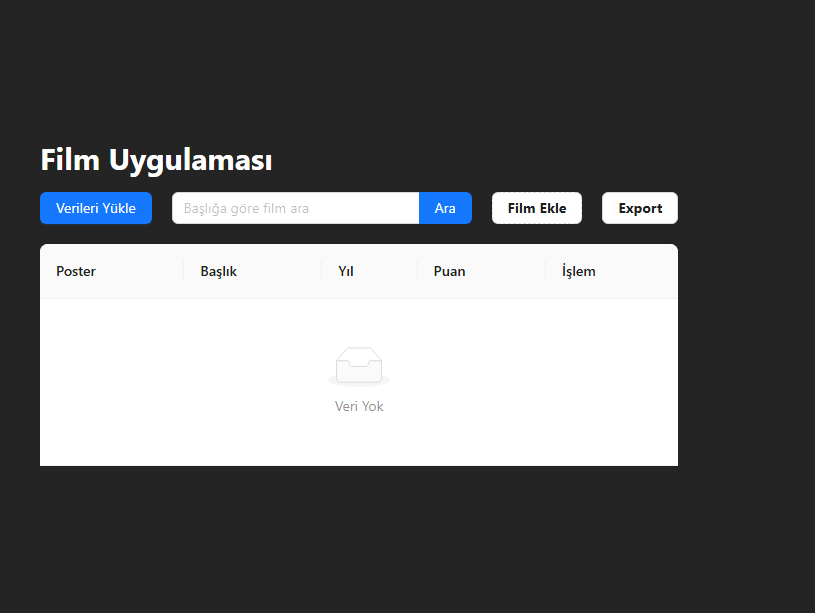
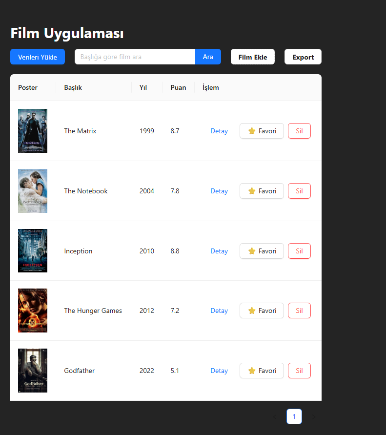
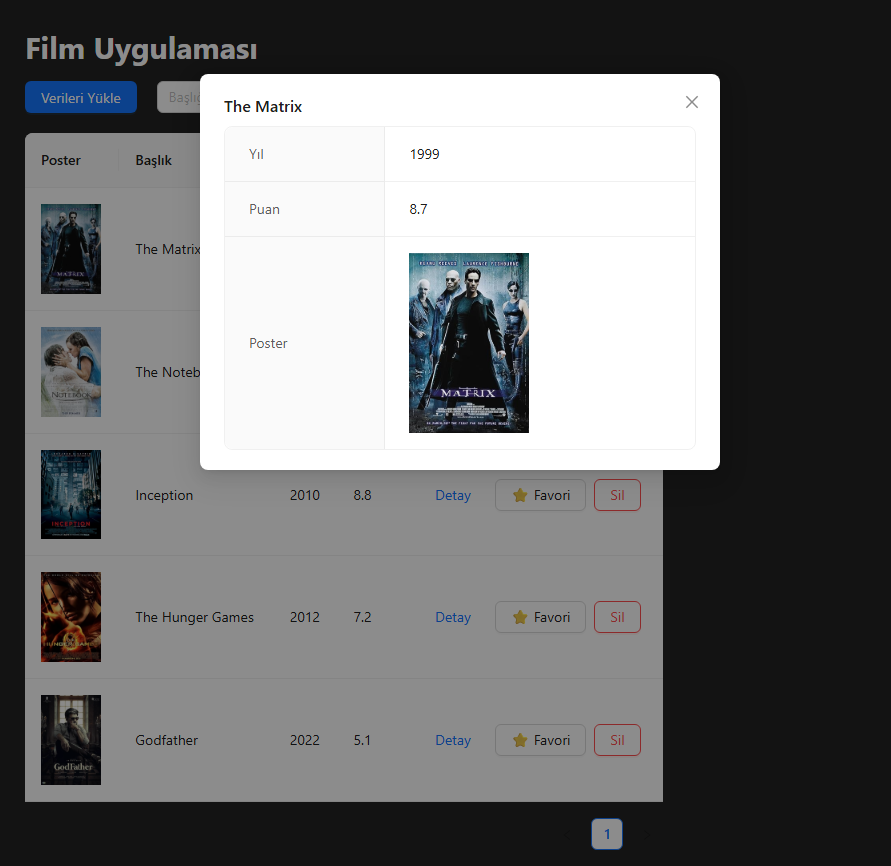

# 🎬 Film Uygulaması

Bu proje, film bilgilerini yönetebileceğiniz full stack bir uygulamadır.  
Frontend: **React (Vite + Ant Design)**  
Backend: **Flask + SQLite + OMDb API**

---

## 🚀 Özellikler

- 🎥 Film listesi görüntüleme  
- 🔍 Film arama (başlığa göre filtreleme)  
- ➕ Yeni film ekleme (modal form ile)  
- ✏️ Film bilgisi güncelleme  
- ❌ Film silme (onaylı)  
- ⭐ Favorilere ekleme  
- 📤 CSV formatında dışa aktarma  
- 🖼️ OMDb API ile otomatik poster ve IMDb puanı çekme

---

## 🖼️ Uygulama Görselleri

### 1. Boş veri görünümü


### 2. Yüklü film listesi


### 3. Film detayı modalı


### 4. Silme onayı penceresi


---

## 🛠️ Kurulum

### 🔹 Backend (Flask)

```bash
cd flask_api
python -m venv venv
venv\Scripts\activate      # Windows için
pip install -r requirements.txt
python app.py

📌 app.py içinde OMDb API Key tanımlanmalı:

python
Kopyala
Düzenle
API_KEY = "OMDb'den alınan key buraya"
🔹 Frontend (React + Ant Design)
bash
Kopyala
Düzenle
cd my-antd-app
npm install
npm run dev

📦 Kullanılan Teknolojiler
Alan	Teknoloji
Frontend	React, Vite, Ant Design, Axios
Backend	Flask, SQLite
API	OMDb API
Diğer	CSV export, modal, arama, responsive tasarım

📁 Proje Yapısı
bash
Kopyala
Düzenle
film_uygulaması/
├── flask_api/
│   ├── app.py
│   ├── database.db
├── my-antd-app/
│   ├── src/
│   └── ...
├── assets/
│   ├── ekran1.png
│   ├── ekran2.png
│   ├── ekran3.png
│   └── ekran4.png
├── README.md
└── .gitignore
